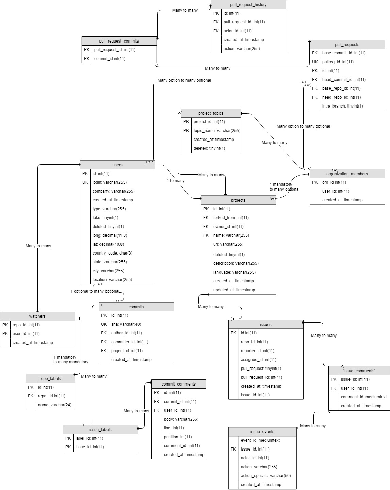

# Sprint 1 Design Document

## Deployment Environment

[Link to your deployment environment]()

## Functional Requirements

1. Individual contributor inspecting their impact on a repo’s score
    - See repo’s score
    - See how their contributions individually impacts each statistic in question
    - Description of how each stat is used to calculate scores for each section
2. Business looking for a repo’s score’s consistency over longer time periods
    - See repo’s score
    - See how their consistent each statistic’s score (and overall score) is over an adjustable period of time
    - See how each stat individually impacts the overall score
    - See the history of the score
    - Description of how each stat is used to calculate scores for each section
3. Community manager inspecting a repo’s score on recent timeframes
    - See repo’s score
    - See overall score over an adjustable period of time (1 month default)
    - See how each stat individually impacts the overall score
    - Description of how each stat is used to calculate scores for each section

### Stats to calculate the score
1. Code Development (commits, pull req, issues)
    - Frequency of commits
    - Number of commit
    - LOC ratio? (facade)
    - Num issues
    - Num pull requests
2. Issue Resolution
    - Comments (issues, commits, code reviews/pull requests)
    - Time duration to comments
    - Issue_Duration
    - Issue_Participants
    - Issue backlog - how many are left open
3. Community Growth
    - Community age
    - Pull requests decline
    - "How many external contributors we have?"
    - "Which part of the activity is done by external contributors?"
    - "Which ones are the key areas for external contributors?"
    - "In which roles are external contributors collaborating?"
    - "How is the onboarding process for external contributors?"


## Database Design
In order for individual contributors to inspect their impact on repository scores, we would need a use case that identifies their own contributions to alternate projects. In addition, we would need the use case to allow visual representation of their repository score on projects they are working on. Furthermore, we would need the use case to calculate the individual’s impact on a repo’s score.     

In addition, we would need a use case that allows business to view consistent repo scores over  various amount of time. The use case would need to allow individuals to view the repo scores, and display the overall score based off their consistency to various projects. Furthermore, the use case would need to display the overall history of scores and provide brief descriptions of each calculation for the scores. 

Lastly, we’d need a use case for community managers to inspect a recent time frame of repo scores. The use case would also need to display the repo scores  and the overall scores over an adjustable period of time. In addition, it would need to display individual show how each stat impacts the overall score. Finally, it would need to provide a description of each calculation for the scores in each section. 

For this design we will be using multiple software components. We will be using Augur’s dependencies in order for Augur to run properly. In addition, we will use sublime text to manipulate some of the original coding that is provided in the Augur project.    

We want the Augur project to be a lot more user friendly and easier to navigate. In other words, we will also make a few changes to the homepage of Augur along with other repositories that will help satisfy the requirements of our use cases for different users.

### ERD
1. GHTorrent


2. Facade



### DDL

```SQL

# GH TORRENT

CREATE TABLE 'commit_comments' (
  'id' int(11) NOT NULL AUTO_INCREMENT,
  'commit_id' int(11) NOT NULL,
  'user_id' int(11) NOT NULL,
  'body' varchar(256) DEFAULT NULL,
  'line' int(11) DEFAULT NULL,
  'position' int(11) DEFAULT NULL,
  'comment_id' int(11) NOT NULL,
  'created_at' timestamp NOT NULL DEFAULT CURRENT_TIMESTAMP,
  PRIMARY KEY ('id'),
  UNIQUE KEY 'comment_id' ('comment_id'),
  KEY 'commit_comments_ibfk_1' ('commit_id'),
  KEY 'commit_comments_ibfk_2' ('user_id')
) ENGINE=MyISAM AUTO_INCREMENT=5952036 DEFAULT CHARSET=utf8;

CREATE TABLE 'commits' (
  'id' int(11) NOT NULL AUTO_INCREMENT,
  'sha' varchar(40) DEFAULT NULL,
  'author_id' int(11) DEFAULT NULL,
  'committer_id' int(11) DEFAULT NULL,
  'project_id' int(11) DEFAULT NULL,
  'created_at' timestamp NOT NULL DEFAULT CURRENT_TIMESTAMP,
  PRIMARY KEY ('id'),
  UNIQUE KEY 'sha' ('sha'),
  KEY 'commits_ibfk_1' ('author_id'),
  KEY 'commits_ibfk_2' ('committer_id'),
  KEY 'commits_ibfk_3' ('project_id')
) ENGINE=MyISAM AUTO_INCREMENT=1182678117 DEFAULT CHARSET=utf8;

CREATE TABLE 'issue_comments' (
  'issue_id' int(11) NOT NULL,
  'user_id' int(11) NOT NULL,
  'comment_id' mediumtext NOT NULL,
  'created_at' timestamp NOT NULL DEFAULT CURRENT_TIMESTAMP,
  KEY 'issue_comments_ibfk_1' ('issue_id'),
  KEY 'issue_comments_ibfk_2' ('user_id')
) ENGINE=MyISAM DEFAULT CHARSET=utf8;

CREATE TABLE 'issue_events' (
  'event_id' mediumtext NOT NULL,
  'issue_id' int(11) NOT NULL,
  'actor_id' int(11) NOT NULL,
  'action' varchar(255) NOT NULL,
  'action_specific' varchar(50) DEFAULT NULL,
  'created_at' timestamp NOT NULL DEFAULT CURRENT_TIMESTAMP,
  KEY 'issue_events_ibfk_1' ('issue_id'),
  KEY 'issue_events_ibfk_2' ('actor_id')
) ENGINE=MyISAM DEFAULT CHARSET=utf8;

CREATE TABLE 'issues' (
  'id' int(11) NOT NULL AUTO_INCREMENT,
  'repo_id' int(11) DEFAULT NULL,
  'reporter_id' int(11) DEFAULT NULL,
  'assignee_id' int(11) DEFAULT NULL,
  'pull_request' tinyint(1) NOT NULL,
  'pull_request_id' int(11) DEFAULT NULL,
  'created_at' timestamp NOT NULL DEFAULT CURRENT_TIMESTAMP,
  'issue_id' int(11) NOT NULL,
  PRIMARY KEY ('id'),
  KEY 'issues_ibfk_1' ('repo_id'),
  KEY 'issues_ibfk_2' ('reporter_id'),
  KEY 'issues_ibfk_3' ('assignee_id'),
  KEY 'issues_ibfk_4' ('pull_request_id')
) ENGINE=MyISAM AUTO_INCREMENT=87987040 DEFAULT CHARSET=utf8;

CREATE TABLE 'organization_members' (
  'org_id' int(11) NOT NULL,
  'user_id' int(11) NOT NULL,
  'created_at' timestamp NOT NULL DEFAULT CURRENT_TIMESTAMP,
  PRIMARY KEY ('org_id','user_id'),
  KEY 'organization_members_ibfk_2' ('user_id')
) ENGINE=MyISAM DEFAULT CHARSET=utf8;

CREATE TABLE 'project_topics' (
  'project_id' int(11) NOT NULL,
  'topic_name' varchar(255) NOT NULL DEFAULT '',
  'created_at' timestamp NOT NULL DEFAULT CURRENT_TIMESTAMP,
  'deleted' tinyint(1) NOT NULL DEFAULT '0',
  PRIMARY KEY ('project_id','topic_name')
) ENGINE=MyISAM DEFAULT CHARSET=utf8;

CREATE TABLE 'projects' (
  'id' int(11) NOT NULL AUTO_INCREMENT,
  'url' varchar(255) DEFAULT NULL,
  'owner_id' int(11) DEFAULT NULL,
  'name' varchar(255) NOT NULL,
  'description' varchar(255) DEFAULT NULL,
  'language' varchar(255) DEFAULT NULL,
  'created_at' timestamp NOT NULL DEFAULT CURRENT_TIMESTAMP,
  'forked_from' int(11) DEFAULT NULL,
  'deleted' tinyint(1) NOT NULL DEFAULT '0',
  'updated_at' timestamp NOT NULL DEFAULT '1970-01-01 01:00:01',
  PRIMARY KEY ('id'),
  KEY 'projects_ibfk_1' ('owner_id'),
  KEY 'projects_ibfk_2' ('forked_from'),
  KEY 'name' ('name')
) ENGINE=MyISAM AUTO_INCREMENT=114811906 DEFAULT CHARSET=utf8;

CREATE TABLE 'pull_request_commits' (
  'pull_request_id' int(11) NOT NULL,
  'commit_id' int(11) NOT NULL,
  PRIMARY KEY ('pull_request_id','commit_id'),
  KEY 'pull_request_commits_ibfk_2' ('commit_id')
) ENGINE=MyISAM DEFAULT CHARSET=utf8;

CREATE TABLE 'pull_request_history' (
  'id' int(11) NOT NULL AUTO_INCREMENT,
  'pull_request_id' int(11) NOT NULL,
  'created_at' timestamp NOT NULL DEFAULT CURRENT_TIMESTAMP,
  'action' varchar(255) NOT NULL,
  'actor_id' int(11) DEFAULT NULL,
  PRIMARY KEY ('id'),
  KEY 'pull_request_history_ibfk_1' ('pull_request_id'),
  KEY 'pull_request_history_ibfk_2' ('actor_id')
) ENGINE=MyISAM AUTO_INCREMENT=126865248 DEFAULT CHARSET=utf8;

CREATE TABLE 'pull_requests' (
  'id' int(11) NOT NULL AUTO_INCREMENT,
  'head_repo_id' int(11) DEFAULT NULL,
  'base_repo_id' int(11) NOT NULL,
  'head_commit_id' int(11) DEFAULT NULL,
  'base_commit_id' int(11) NOT NULL,
  'pullreq_id' int(11) NOT NULL,
  'intra_branch' tinyint(1) NOT NULL,
  PRIMARY KEY ('id'),
  UNIQUE KEY 'pullreq_id' ('pullreq_id','base_repo_id'),
  KEY 'pull_requests_ibfk_1' ('head_repo_id'),
  KEY 'pull_requests_ibfk_2' ('base_repo_id'),
  KEY 'pull_requests_ibfk_3' ('head_commit_id'),
  KEY 'pull_requests_ibfk_4' ('base_commit_id')
) ENGINE=MyISAM AUTO_INCREMENT=48550421 DEFAULT CHARSET=utf8;

CREATE TABLE 'repo_labels' (
  'id' int(11) NOT NULL AUTO_INCREMENT,
  'repo_id' int(11) DEFAULT NULL,
  'name' varchar(24) NOT NULL,
  PRIMARY KEY ('id'),
  KEY 'repo_labels_ibfk_1' ('repo_id')
) ENGINE=MyISAM AUTO_INCREMENT=299720027 DEFAULT CHARSET=utf8;

CREATE TABLE 'issue_labels' (
  'label_id' int(11) NOT NULL,
  'issue_id' int(11) NOT NULL,
  PRIMARY KEY ('issue_id','label_id'),
  KEY 'issue_labels_ibfk_1' ('label_id')
) ENGINE=MyISAM DEFAULT CHARSET=utf8;

CREATE TABLE 'users' (
  'id' int(11) NOT NULL AUTO_INCREMENT,
  'login' varchar(255) NOT NULL,
  'company' varchar(255) DEFAULT NULL,
  'created_at' timestamp NOT NULL DEFAULT CURRENT_TIMESTAMP,
  'type' varchar(255) NOT NULL DEFAULT 'USR',
  'fake' tinyint(1) NOT NULL DEFAULT '0',
  'deleted' tinyint(1) NOT NULL DEFAULT '0',
  'long' decimal(11,8) DEFAULT NULL,
  'lat' decimal(10,8) DEFAULT NULL,
  'country_code' char(3) DEFAULT NULL,
  'state' varchar(255) DEFAULT NULL,
  'city' varchar(255) DEFAULT NULL,
  'location' varchar(255) DEFAULT NULL,
  PRIMARY KEY ('id'),
  UNIQUE KEY 'login' ('login')
) ENGINE=MyISAM AUTO_INCREMENT=47149986 DEFAULT CHARSET=utf8;

CREATE TABLE 'watchers' (
  'repo_id' int(11) NOT NULL,
  'user_id' int(11) NOT NULL,
  'created_at' timestamp NOT NULL DEFAULT CURRENT_TIMESTAMP,
  PRIMARY KEY ('repo_id','user_id'),
  KEY 'watchers_ibfk_2' ('user_id')
) ENGINE=MyISAM DEFAULT CHARSET=utf8;

-----------------------------------------------------------------------------------
# FACADE

CREATE TABLE 'affiliations' (
  'id' int(10) unsigned NOT NULL AUTO_INCREMENT,
  'domain' varchar(64) COLLATE utf8mb4_unicode_ci NOT NULL,
  'affiliation' varchar(64) COLLATE utf8mb4_unicode_ci NOT NULL,
  'start_date' date NOT NULL DEFAULT '1970-01-01',
  'active' tinyint(1) NOT NULL DEFAULT 1,
  'last_modified' timestamp(6) NOT NULL DEFAULT current_timestamp(6) ON UPDATE current_timestamp(6),
  PRIMARY KEY ('id'),
  UNIQUE KEY 'domain,affiliation,start_date' ('domain','affiliation','start_date'),
  KEY 'domain,active' ('domain','active')
) ENGINE=InnoDB AUTO_INCREMENT=522 DEFAULT CHARSET=utf8mb4 COLLATE=utf8mb4_unicode_ci;

CREATE TABLE 'code_counter' (
  'Language' varchar(255) DEFAULT NULL,
  'Location' varchar(500) DEFAULT NULL,
  'Filename' varchar(255) DEFAULT NULL,
  'LOC' int(6) DEFAULT NULL,
  'Code' int(6) DEFAULT NULL,
  'Comments' int(6) DEFAULT NULL,
  'Blanks' int(6) DEFAULT NULL,
  'Complexity' int(6) DEFAULT NULL,
  'Repo' varchar(500) DEFAULT NULL
) ENGINE=InnoDB DEFAULT CHARSET=utf8mb4;

CREATE TABLE 'project_weekly_cache' (
  'projects_id' int(10) unsigned NOT NULL,
  'email' varchar(128) COLLATE utf8mb4_unicode_ci NOT NULL,
  'affiliation' varchar(128) COLLATE utf8mb4_unicode_ci DEFAULT NULL,
  'week' tinyint(3) unsigned NOT NULL,
  'year' smallint(5) unsigned NOT NULL,
  'added' bigint(20) unsigned NOT NULL,
  'removed' bigint(20) unsigned NOT NULL,
  'whitespace' bigint(20) unsigned NOT NULL,
  'files' bigint(20) unsigned NOT NULL,
  'patches' bigint(20) unsigned NOT NULL,
  KEY 'projects_id,year,affiliation' ('projects_id','year','affiliation'),
  KEY 'projects_id,year,email' ('projects_id','year','email'),
  KEY 'projects_id,affiliation' ('projects_id','affiliation'),
  KEY 'projects_id,email' ('projects_id','email')
) ENGINE=InnoDB DEFAULT CHARSET=utf8mb4 COLLATE=utf8mb4_unicode_ci;

CREATE TABLE 'project_monthly_cache' (
  'projects_id' int(10) unsigned NOT NULL,
  'email' varchar(128) COLLATE utf8mb4_unicode_ci NOT NULL,
  'affiliation' varchar(128) COLLATE utf8mb4_unicode_ci DEFAULT NULL,
  'month' tinyint(3) unsigned NOT NULL,
  'year' smallint(5) unsigned NOT NULL,
  'added' bigint(20) unsigned NOT NULL,
  'removed' bigint(20) unsigned NOT NULL,
  'whitespace' bigint(20) unsigned NOT NULL,
  'files' bigint(20) unsigned NOT NULL,
  'patches' bigint(20) unsigned NOT NULL,
  KEY 'projects_id,year,affiliation' ('projects_id','year','affiliation'),
  KEY 'projects_id,year,email' ('projects_id','year','email'),
  KEY 'projects_id,affiliation' ('projects_id','affiliation'),
  KEY 'projects_id,email' ('projects_id','email')
) ENGINE=InnoDB DEFAULT CHARSET=utf8mb4 COLLATE=utf8mb4_unicode_ci;

CREATE TABLE 'repo_weekly_cache' (
  'repos_id' int(10) unsigned NOT NULL,
  'email' varchar(128) COLLATE utf8mb4_unicode_ci NOT NULL,
  'affiliation' varchar(128) COLLATE utf8mb4_unicode_ci DEFAULT NULL,
  'week' tinyint(3) unsigned NOT NULL,
  'year' smallint(5) unsigned NOT NULL,
  'added' bigint(20) unsigned NOT NULL,
  'removed' bigint(20) unsigned NOT NULL,
  'whitespace' bigint(20) unsigned NOT NULL,
  'files' bigint(20) unsigned NOT NULL,
  'patches' bigint(20) unsigned NOT NULL,
  KEY 'repos_id,year,affiliation' ('repos_id','year','affiliation'),
  KEY 'repos_id,year,email' ('repos_id','year','email'),
  KEY 'repos_id,affiliation' ('repos_id','affiliation'),
  KEY 'repos_id,email' ('repos_id','email')
) ENGINE=InnoDB DEFAULT CHARSET=utf8mb4 COLLATE=utf8mb4_unicode_ci;

CREATE TABLE 'repo_monthly_cache' (
  'repos_id' int(10) unsigned NOT NULL,
  'email' varchar(128) COLLATE utf8mb4_unicode_ci NOT NULL,
  'affiliation' varchar(128) COLLATE utf8mb4_unicode_ci DEFAULT NULL,
  'month' tinyint(3) unsigned NOT NULL,
  'year' smallint(5) unsigned NOT NULL,
  'added' bigint(20) unsigned NOT NULL,
  'removed' bigint(20) unsigned NOT NULL,
  'whitespace' bigint(20) unsigned NOT NULL,
  'files' bigint(20) unsigned NOT NULL,
  'patches' bigint(20) unsigned NOT NULL,
  KEY 'repos_id,year,affiliation' ('repos_id','year','affiliation'),
  KEY 'repos_id,year,email' ('repos_id','year','email'),
  KEY 'repos_id,affiliation' ('repos_id','affiliation'),
  KEY 'repos_id,email' ('repos_id','email')
) ENGINE=InnoDB DEFAULT CHARSET=utf8mb4 COLLATE=utf8mb4_unicode_ci;

CREATE TABLE 'projects' (
  'id' int(10) unsigned NOT NULL AUTO_INCREMENT,
  'name' varchar(128) COLLATE utf8mb4_unicode_ci NOT NULL,
  'description' varchar(256) COLLATE utf8mb4_unicode_ci DEFAULT NULL,
  'website' varchar(128) COLLATE utf8mb4_unicode_ci DEFAULT NULL,
  'recache' tinyint(1) DEFAULT 1,
  'last_modified' timestamp(6) NOT NULL DEFAULT current_timestamp(6) ON UPDATE current_timestamp(6),
  PRIMARY KEY ('id')
) ENGINE=InnoDB AUTO_INCREMENT=16 DEFAULT CHARSET=utf8mb4 COLLATE=utf8mb4_unicode_ci;

CREATE TABLE 'repos' (
  'id' int(10) unsigned NOT NULL AUTO_INCREMENT,
  'projects_id' int(10) unsigned NOT NULL,
  'git' varchar(256) COLLATE utf8mb4_unicode_ci NOT NULL,
  'path' varchar(256) COLLATE utf8mb4_unicode_ci DEFAULT NULL,
  'name' varchar(256) COLLATE utf8mb4_unicode_ci DEFAULT NULL,
  'added' timestamp(6) NOT NULL DEFAULT current_timestamp(6),
  'status' varchar(32) COLLATE utf8mb4_unicode_ci NOT NULL,
  PRIMARY KEY ('id')
) ENGINE=InnoDB AUTO_INCREMENT=21016 DEFAULT CHARSET=utf8mb4 COLLATE=utf8mb4_unicode_ci;

```

## Files that are stubbed out in your repository, with comments about the use cases they are connected to. These sections may not all exist for the Zephyr project teams. Simply explain them as best you can.

### User Interface Files

1. ScoreCard.vue
2. StreamChart.vue
3. RelativeLineChart.vue
4. Tabs.vue


### Model Files (Database Access)

1. ghtorrent.py
2. facade.py
3. ghtorrent/routes.py
4. facade/routes.py


### Controller Files (API or other)

1. router.js
2. AugurApi.js


## Describe languages you need to use, and any gaps in skills on your team.

1. Python
    - SQLAlchemy to query the database
    - Run formulas on data to calculate score(s)
    - Create the endpoint in the backend

2. JavaScript
    - Access endpoint in the frontend
    - Create charts with Vega-Lite to display data
    - Mount the charts on a new page (ScoreCard.vue) with a new tab (Score) using a new route definition (/score)

3. Skill gaps, if any, otherwise specify who is doing what
    - Gabe - Backend and frontend (python and js)
    - Felipe - Backend and frontend (python and js)
    - Megan - HTML/CSS for frontend
